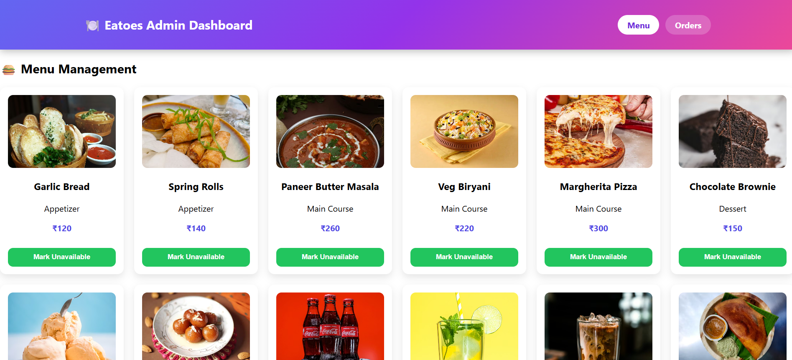
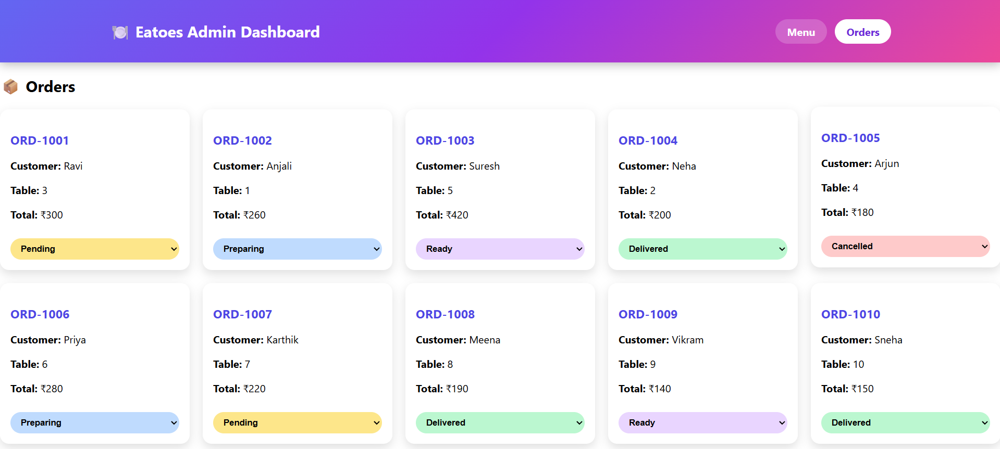
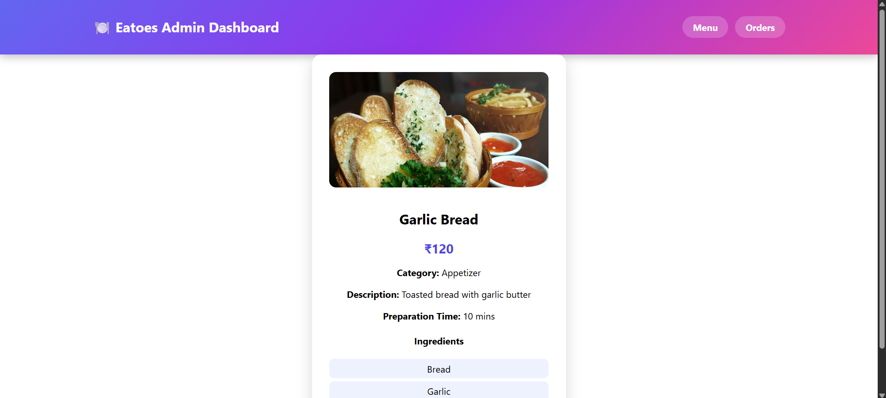
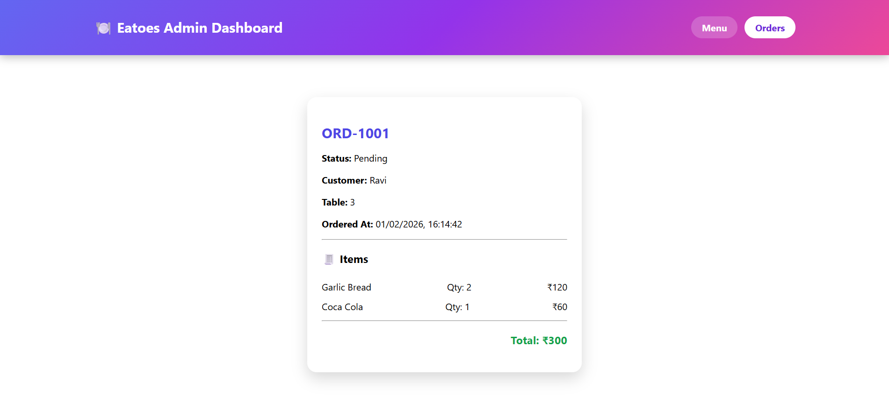

# 🍽️ Restaurant Admin Dashboard  
**Eatoes Intern – Technical Assessment**

A full-stack **Restaurant Admin Dashboard** that allows restaurant owners to manage menu items, track orders, and monitor order status in real time.  
Built using **React, Node.js, Express, and MongoDB**, following real-world best practices.

---

## 🚀 Live Demo

- **Frontend (Netlify):** https://rohitrestaurantadmindashboard.netlify.app/
- **Backend API (Render):** https://restaurant-admin-dashboard-xn7t.onrender.com  

---

## 📌 Features

### 🧾 Menu Management
- View all menu items in a **responsive grid**
- Toggle **Available / Unavailable** status directly from menu cards
- Click on any item to view **detailed information**
- Optimistic UI updates for instant feedback
- Clean, colorful UI built with **CSS**

### 🔍 Search & Performance
- Debounced search (300ms) for menu items
- Efficient MongoDB queries with text indexing

### 📦 Orders Dashboard
- View orders in a **side-by-side card layout**
- Color-coded order status dropdown
- Update order status (Pending → Preparing → Ready → Delivered)
- Click any order to view **full order details**

### 📄 Order Details Page
- Customer name & table number
- Ordered items with quantity & price
- Total amount
- Order status & timestamp

---

## 🛠️ Tech Stack

### Frontend
- React 18
- React Router DOM
- Axios
- CSS

### Backend
- Node.js
- Express.js
- MongoDB
- Mongoose

### Database
- MongoDB Atlas (Free Tier)

---

## 📂 Project Structure

```
root/
├── server/
│ ├── config/
│ │  └── db.js 
│ ├── controllers/
│ │  ├── menuController.js
│ │  └── orderController.js
│ ├── models/
│ │  ├── MenuItem.js
│ │  └── Order.js
│ ├── routes/
│ │  ├── menuRoutes.js
│ │  └── orderRoutes.js
│ ├── scripts/
│ │  ├── MenuData.js
│ │  ├── OrderData.js
│ │  └── seed.js
│ └── server.js
│
└── client/
    ├── src/
    │ ├── api/
    │ │  └── axios.js
    │ ├── components/
    │ │  ├── Header.js
    │ │  └── MenuCard.js
    │ ├── pages/
    │ │  ├── MenuItemDetails.js
    │ │  ├── MenuManagement.js
    │ │  ├── OrderDetails.js
    │ │  └── OrdersDashboard.js
    │ ├── styles/
    │ │  ├── global.css
    │ │  ├── header.css
    │ │  ├── menu.css
    │ │  └── orders.css
    │ ├── App.js
    │ └── index.js
    └── public/\

```

---

## 🗄️ Database Schema

### MenuItem
- `name` (String, required, indexed)
- `description` (String)
- `category` (Enum: Appetizer, Main Course, Dessert, Beverage)
- `price` (Number)
- `ingredients` (Array of Strings)
- `isAvailable` (Boolean, default: true)
- `preparationTime` (Number)
- `imageUrl` (String)
- `timestamps`

### Order
- `orderNumber` (String, unique)
- `items` (menuItem, quantity, price)
- `totalAmount` (Number)
- `status` (Pending, Preparing, Ready, Delivered, Cancelled)
- `customerName` (String)
- `tableNumber` (Number)
- `timestamps`

---

## 🔌 API Endpoints

### Menu APIs
| Method | Endpoint | Description |
|------|---------|------------|
| GET | `/api/menu` | Get all menu items |
| GET | `/api/menu/search?q=` | Search menu items |
| GET | `/api/menu/:id` | Get menu item by ID |
| POST | `/api/menu` | Create menu item |
| PUT | `/api/menu/:id` | Update menu item |
| DELETE | `/api/menu/:id` | Delete menu item |
| PATCH | `/api/menu/:id/availability` | Toggle availability |

### Order APIs
| Method | Endpoint | Description |
|------|---------|------------|
| GET | `/api/orders` | Get all orders |
| GET | `/api/orders/:id` | Get order details |
| POST | `/api/orders` | Create order |
| PATCH | `/api/orders/:id/status` | Update order status |

---

## 🌱 Seed Data

The project includes a **seed script** that populates:
- **15+ menu items** across all categories
- **10 sample orders** with different statuses

### Run seed script:
```bash
cd server
node scripts/seed.js
```

---

## ▶️ Running the Project Locally

### Backend
```bash
cd server
npm install
node server.js
```
### Frontend
```bash
cd client
npm install
npm start
```

---

## 🖼️ Screenshots

### 🔐 Menu Page


---

### 📦 Orders Page


---

### Item Detail Page


---

### Order Detail Page


---

## 👨‍💻 Author

**Rohit Raparthi**  
📧 [rohit.raparthi2003@gmail.com](mailto:rohit.raparthi2003@gmail.com)  
💼 [LinkedIn](https://www.linkedin.com/in/rohit-raparthi/) / [GitHub](https://github.com/RohitRaparthi/)